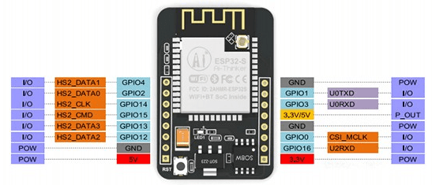
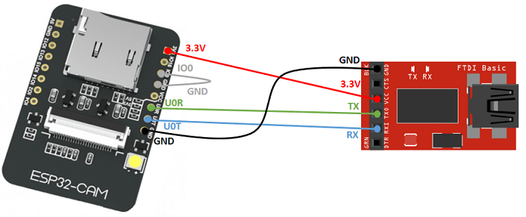
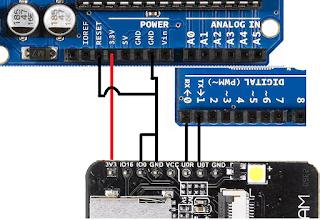
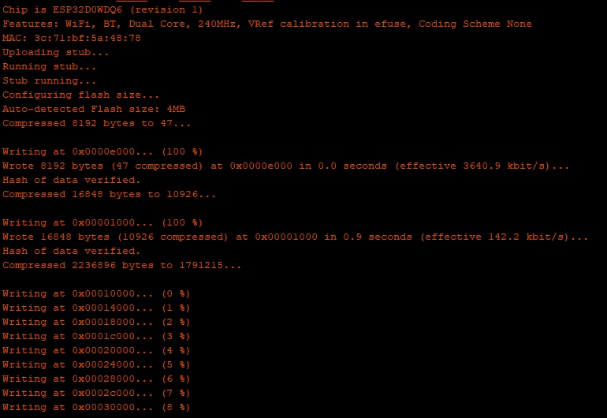
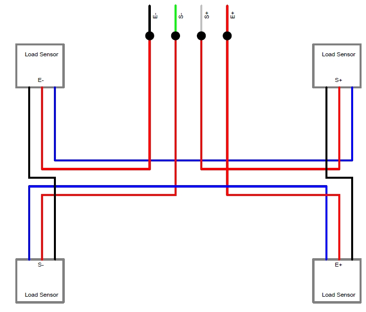
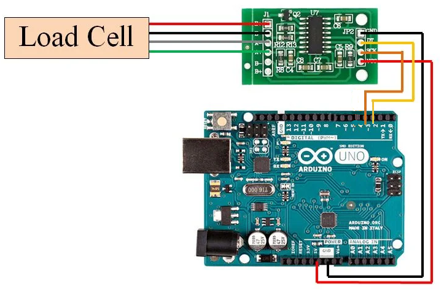

# ESP32-CAM-Weight
Use ESP32 Cam to upload images to S3 bucket when a new object is placed or taken off of the Weight Scale.


## Pre-requisites
To run the main project we require the following pre-requisite hardware:
  1. ESP32 CAM AI Thinker
  2. Arduino Uno
  3. HX711 Amplifier
  4. Weight Scale
  5. Jumper Cables.

## Install Arduino IDE
To start programming the ESP-CAM you need to install Arduino IDE on your computer. Click this [link](https://www.arduino.cc/en/Main/Software) to download the arduino IDE.

## Setting up the libraries
The following libraries need to be downloaded and installed in the arduino software. 
  1. [Async-MQTT](https://github.com/marvinroger/async-mqtt-client.git)
  2. [Arduino-ESP-32 with base64](https://github.com/espressif/arduino-esp32.git)
  3. [Async-TCP-Master](https://github.com/me-no-dev/AsyncTCP.git)
  4. [HX711 Library](https://github.com/bogde/HX711.git)
  5. [Pub-Sub-Client-MQTT](https://github.com/knolleary/pubsubclient.git)

## Setting up the ESP CAM
### Pre-requisites
For setting up the ESP CAM you need the following hardware:
  1. ESP CAM
  2. FTDI or Arduino Uno
  3. Jumper Cables (Male - Female and Female - Female)

### Pin-out
If you have an FTDI, connect your ESP Cam to the FTDI as follows:

.

If you have an Arduino uno, connect your ESP Cam to the Arduino as follows :

.

### Uploading the code
### Pre-requisites

You need to install the ESP boards. 
Click on **File->Preferences** and add the line below in the Additional Boards Manager URLs:

```
,https://dl.espressif.com/dl/package_esp32_index.json
```

Now click on **Tools->Boards->Boards Manager**.
A new window will pop up. In the search section type **esp32**. Click on the option and install. 
You are ready to program the ESP CAM now. 

### Verifying the setup. 
To verify that everything is working smoothly. Open the file **CameraWebServer.ino** given in the respository.
Change the ssid and password to those of your Wifi router.

Click on **Tools** and make sure all the settings are as follows:
  1. Board : ESP32 Wrover Module
  2. Upload Speed: 115200
  3. Flash Frequency: 40 MHz
  4. Flash Mode: QIO
  5. Partition Scheme: Huge APP (3MB No OTA)
  6. Core Debug Level: None
  7. Port: (Choose the port here that your FTDI or Arduino Uno is connected to).
  8. Programmer: AVR ISP
  
  (**Note: If you are using Arduino Uno, make sure to remove the chip from the board before programming.**
 
 After the settings are complete click on upload. 
 The IDE will start compiling. 
 After the compiling has been completed it will change to uploading, at this moment press the reset button on the ESP-CAM once.
 The following information or something similar will be displayed at the bottom.
 
 . 
 
 Wait for the upload to complete.
 Remove the USB cable.
 Remove the jumper connecting IO0 to GND. 
 Connect the USB cable again and open the serial monitor. 
 It will give you an IP address.
 Open that IP address in the browser, scroll down and click on start streaming. 
 Congratulations!!. Your ESP CAM is working. 

### Uploading the Main Code.
Download [Click-Pic.ino](/ESP-CAM/Click-Pic.ino) from the repository. 

Scroll down and look for:
```
#include <C:\Users\AJ_Khalid\Documents\Arduino\libraries\arduino-esp32-master\tools\sdk\include\mbedtls\mbedtls\base64.h>
```

Replace ```C:\Users\AJ_Khalid\Documents\Arduino\libraries\``` with the directory where the folder ```arduino-esp32-master``` is placed. This library was installed in Setting up the libraries section. 

After this scroll down and look for:

```
const char* ssid = "";
const char* password = "";
```

Replace these with the ones of your router. 
Write informatation inside the inverted comas e.g. if your ssid and password are TP-link and 12345, enter them as:

```
const char* ssid = "TP-link";
const char* password = "12345";
```


Upload it to your ESP.

Also, remember to connect the GPIO4 of the ESP CAM to digital Pin 6 of your Arduino Uno through resistors making a voltage divider of 3.3 V or a logic converter.

## Setting up the Weight Scale
### Connections
To convert the Weight Scale to be of use for our project we need to open it and make some enhancements.

First open the weight scale from the back. The wires will be connected to a central processor. It is best to leave most of it as and only change the parts that are required. 

First locate the VCC/3V/5V any of these labels on the chip. This is the power source. If you want to power the weight scale using external power source change cut the wire connected to this label and connect it to the positive of your power source. 

Next locate the label GND **This is essential**. Connect a wire to this pad (You can choose not to cut the GND wire but connecting one to it is essential). Put the second end of this wire into the GND pin of your arduino UNO.

Now comes the part of wiring the load cells. 
The configuration of the weight scale is as shown in this image.



Now find the labels E+ and E- on the weight scale chip. Disconnect both of these and connect them to the E+ and E- of the HX711 amplifier.
Next set of labels can be either S+ and S- or A+ or A- depending on the weight scale. Connect these to A+ and A- on the HX711.

Wiring the Weight Scale is completed.

### Wiring the HX711
Now, let's connect HX711 to the Arduino Uno.
  1. Connect the VCC to Arduino 5V.
  2. Connect GND to Arduino GND.
  3. Connect DT to Arduino Digital Pin 2.
  4. Connect SCK to Arduino Digital Pin 3.
  
The image showing the connection is as follows. 


### Running the HX711
Open the HX711 folder in this repository. There will be two codes namely [calibrate.ino](/HX711/calibrate.ino) and [HX711_full.ino](/HX711/HX711_full.ino).

First open calibrate.ino and upload it to your Arduino Uno. **(Remember to put the chip back, disconnect the wire connecting Reset and GND and disconnect Rx/TX of the ESP CAM from the Arduino Uno)**. 

After Uploading is completed, open the serial monitor and turn on the weight scale. Remember that there should be nothing on the weight scale at this point. 
The code will ask you to place something on the weight scale of known weight and enter its weight in grams. 
**Note: Grams is the unit that I defined. You can easily enter a value in kg here and the weights displayed in the next stage will be in kg units.**

After placing the object. Enter the numeric value of its weight in the serial monitor e.g if the weight of object is 500 g enter 500 in the Serial monitor and press Enter. 

After performing a few iterations. The code will provide you with a value. Note this down. 

Now open HX711_full.ino.
In the setup function go the following line.

```
scale.set_scale(-91.56);
```

Replace the number in the brackets with the one you received from the calibrate code and upload. Open the Serial Monitor and it should start displaying the weight. 

**Make sure Digital Pin6 is connected to the GPIO4 of the ESP 32/ESP8266**

## ESP32/ESP8266 Sender
Connect the ESP32/ESP8266 dev board to your computer. 
Open Arduino IDE and choose your board. 
Then download the code [ESP-Sender.ino](/ESP8266-ESP32/ESP-Sender.ino) from the repository and upload it to your ESP. 

Congratulations!! Your project is complete.

